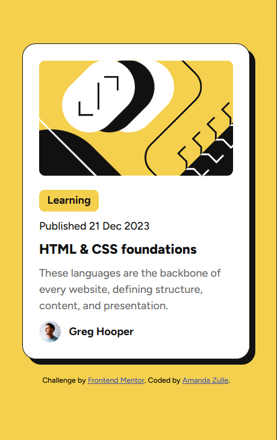
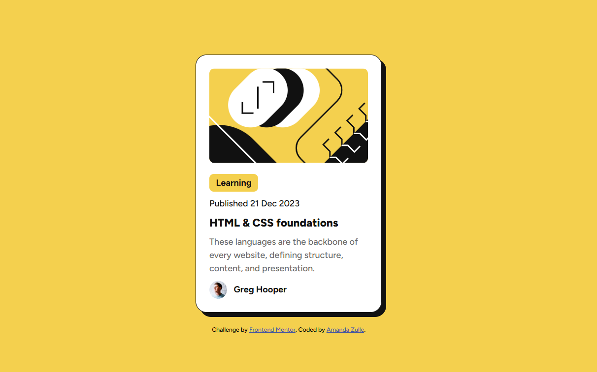

# Frontend Mentor - Solução do Blog Preview Card

Esta é uma solução para o desafio [Blog Preview Card do Frontend Mentor](https://www.frontendmentor.io/challenges/blog-preview-card-ckPaj01Xf). Os desafios do Frontend Mentor ajudam a melhorar as habilidades de programação construindo projetos realistas.

---

## Índice

* Visão geral

    * O desafio
    * Captura de tela
    * Links
* Meu processo

    * Desenvolvido com
    * O que aprendi
    * Desenvolvimento contínuo
    * Colaboração com IA
* Autor

---

## Visão geral

### O desafio

Os usuários devem ser capazes de:

* Visualizar o layout ideal para o conteúdo dependendo do tamanho da tela do dispositivo.

### Captura de tela

 

### Links

* **URL da solução:** https://github.com/Amanda-Zulle/blog-preview-card-desafio-estudo.git


---

## Meu processo

### Desenvolvido com

* HTML5 semântico
* Propriedades personalizadas do CSS (CSS Custom Properties)
* Flexbox
* Google Fonts (Figtree)

---

### O que aprendi

Neste projeto foquei em aproximar ao máximo o resultado final do design original, e isso me ensinou bastante sobre detalhes que fazem diferença:

* A diferença entre usar `<p>` e `<span>` para pequenos rótulos de texto (como a badge "Learning" e a data). `<span>` é mais adequado semanticamente para esse tipo de conteúdo curto, e dentro de um container flex com `flex-direction: column`, cada elemento continua ocupando sua própria linha normalmente:

```css
.card-content {
    display: flex;
    flex-direction: column;
    gap: 0.625rem;
}
```

* Que `<strong>` não garante sozinho o peso visual desejado — é melhor controlar o `font-weight` diretamente na classe:

```css
.category {
    font-weight: 700;
}
```

* Que pequenos ajustes de `gap` e `padding` no container de conteúdo têm um impacto real na fidelidade ao design (pixel-perfect), e vale a pena comparar lado a lado com a imagem original.

---

### Desenvolvimento contínuo

* Quero continuar praticando a comparação cuidadosa entre design e implementação, prestando atenção a detalhes de espaçamento e hierarquia visual.


---

### Colaboração com IA

* **Ferramenta utilizada:** Claude (Anthropic).
* **Como utilizei:** pedi uma revisão comparando minha implementação com a imagem do design original, recebi sugestões de ajustes semânticos no HTML (troca de `<p>` por `<span>`) e de refinamento no CSS (peso de fonte da badge, espaçamento vertical do conteúdo).
* **O que funcionou bem:** a IA ajudou a identificar pequenas diferenças de espaçamento e semântica que eu não tinha notado sozinha, e explicou o porquê de cada sugestão, o que reforçou meu aprendizado em vez de só me dar o código pronto.

---

## Autor

* **GitHub:** [@Amanda-Zulle](https://github.com/Amanda-Zulle)


