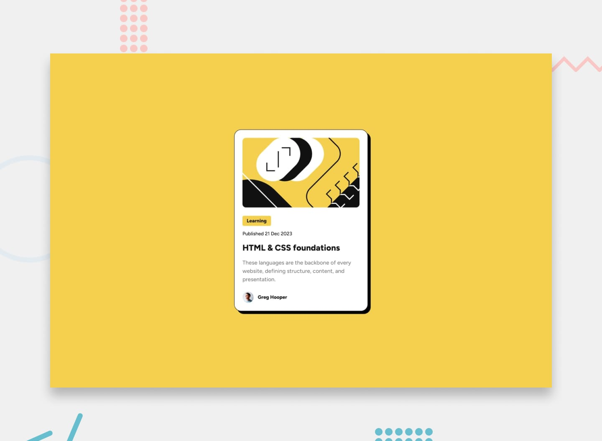

# Frontend Mentor - Blog preview card

## Welcome! 👋

Thanks for checking out this front-end coding challenge.

[Frontend Mentor](https://www.frontendmentor.io) challenges help you improve your coding skills by building realistic projects.

**To do this challenge, you need a basic understanding of HTML and CSS.**

## The challenge

Your challenge is to build out this blog preview card and get it looking as close to the design as possible.

You can use any tools you like to help you complete the challenge. So if you've got something you'd like to practice, feel free to give it a go.

Your users should be able to:

- See hover and focus states for all interactive elements on the page

### Want some support on the challenge? 

[Join our community](https://www.frontendmentor.io/community) and ask questions in the **#help** channel.

## Where to find everything

Your task is to build out the project to the designs inside the `/design` folder. You will find both a mobile and a desktop version of the design. 

The designs are in JPG static format. Using JPGs will mean that you'll need to use your best judgment for styles such as `font-size`, `padding` and `margin`. 

If you would like the Figma design file to gain experience using professional tools and build more accurate projects faster, you can [subscribe as a PRO member](https://www.frontendmentor.io/pro).

All the required assets for this project are in the `/assets` folder. The images are already exported for the correct screen size and optimized.

We also include variable and static font files for the required fonts for this project. You can choose to either link to Google Fonts or use the local font files to host the fonts yourself. Note that we've removed the static font files for the font weights that aren't needed for this project.

There is also a `style-guide.md` file containing the information you'll need, such as color palette and fonts.

## Using AI coding assistants

We've included two files to help you if you're using AI coding assistants (like Claude, GitHub Copilot, Cursor, etc.) while working on this challenge:

- `AGENTS.md` - Contains detailed instructions for AI assistants on how to help you with this challenge. It's tailored to this challenge's difficulty level, so the AI will provide guidance appropriate to your learning stage—offering more support for beginner challenges and encouraging more independence on advanced ones.
- `CLAUDE.md` - A pointer file that directs Claude-based tools to the AGENTS.md instructions.

**How to use them:** You don't need to do anything! These files are automatically detected by most AI coding tools. The AI will read them and adjust its behavior to be a better learning partner—guiding you toward solutions rather than just giving you the answers.

**Note:** These files are designed to help you *learn*, not to do the work for you. The AI is instructed to ask questions, give hints, and explain concepts rather than writing complete solutions.

## Building your project

Feel free to use any workflow that you feel comfortable with. Below is a suggested process, but do not feel like you need to follow these steps:

1. Initialize your project as a public repository on [GitHub](https://github.com/). Creating a repo will make it easier to share your code with the community if you need help. If you're not sure how to do this, [have a read-through of this Try Git resource](https://try.github.io/).
2. Configure your repository to publish your code to a web address. This will also be useful if you need some help during a challenge as you can share the URL for your project with your repo URL. There are a number of ways to do this, and we provide some recommendations below.
3. Look through the designs to start planning out how you'll tackle the project. This step is crucial to help you think ahead for CSS classes to create reusable styles.
4. Before adding any styles, structure your content with HTML. Writing your HTML first can help focus your attention on creating well-structured content.
5. Write out the base styles for your project, including general content styles, such as `font-family` and `font-size`.
6. Start adding styles to the top of the page and work down. Only move on to the next section once you're happy you've completed the area you're working on.

## Deploying your project

As mentioned above, there are many ways to host your project for free. Our recommended hosts are:

- [GitHub Pages](https://pages.github.com/)
- [Vercel](https://vercel.com/)
- [Netlify](https://www.netlify.com/)

You can host your site using one of these solutions or any of our other trusted providers. [Read more about our recommended and trusted hosts](https://www.frontendmentor.io/guides/hosting-your-solution).

## Create a custom `README.md`

We strongly recommend overwriting this `README.md` with a custom one. We've provided a template inside the [`README-template.md`](./README-template.md) file in this starter code.

The template provides a guide for what to add. A custom `README` will help you explain your project and reflect on your learnings. Please feel free to edit our template as much as you like.

Once you've added your information to the template, delete this file and rename the `README-template.md` file to `README.md`. That will make it show up as your repository's README file.

## Submitting your solution

Submit your solution on the platform for the rest of the community to see. Follow our ["Complete guide to submitting solutions"](https://www.frontendmentor.io/guides/how-to-submit-solutions) for tips on how to do this.

Remember, if you're looking for feedback on your solution, be sure to ask questions when submitting it. The more specific and detailed you are with your questions, the higher the chance you'll get valuable feedback from the community.

## Sharing your solution

There are multiple places you can share your solution:

1. Share your solution page in the **#finished-projects** channel of our [community](https://www.frontendmentor.io/community). 
2. Share on [X (formerly Twitter)](https://x.com/frontendmentor) and mention **@frontendmentor**, including the repo and live URLs in your post. We'd love to take a look at what you've built and help share it around.
3. Share your solution on [LinkedIn](https://www.linkedin.com/company/frontend-mentor/).
4. Blog about your experience building your project. Writing about your workflow, technical choices, and talking through your code is a brilliant way to reinforce what you've learned. Great platforms to write on are [dev.to](https://dev.to/), [Hashnode](https://hashnode.com/), and [CodeNewbie](https://community.codenewbie.org/).

We provide templates to help you share your solution once you've submitted it on the platform. Please do edit them and include specific questions when you're looking for feedback. 

The more specific you are with your questions the more likely it is that another member of the community will give you feedback.

## Got feedback for us?

We love receiving feedback! We're always looking to improve our challenges and our platform. So if you have anything you'd like to mention, please email hi[at]frontendmentor[dot]io.

This challenge is completely free. Please share it with anyone who will find it useful for practice.

**Have fun building!** 🚀

## traducao
# Frontend Mentor - Blog Preview Card

## Bem-vindo! 👋

Obrigado por conferir este desafio de programação frontend.

Os desafios do [Frontend Mentor] ajudam você a melhorar suas habilidades de programação construindo projetos realistas.

**Para realizar este desafio, você precisa ter conhecimentos básicos de HTML e CSS.**

## O desafio

Seu desafio é desenvolver este **card de prévia de um blog** e deixá-lo o mais próximo possível do design apresentado.

Você pode utilizar quaisquer ferramentas que quiser para ajudá-lo a concluir o desafio. Portanto, se houver alguma tecnologia ou técnica que você queira praticar, fique à vontade para experimentá-la.

Seus usuários devem ser capazes de:

* Visualizar os estados de **hover** e **focus** de todos os elementos interativos da página.

### Precisa de ajuda com o desafio?

[Entre na nossa comunidade] e faça perguntas no canal **#help**.

## Onde encontrar tudo

Sua tarefa é desenvolver o projeto seguindo os designs encontrados dentro da pasta `/design`.

Você encontrará uma versão do design para **mobile** e outra para **desktop**.

Os designs estão em formato JPG estático. Como os arquivos são JPG, você precisará usar seu próprio julgamento para definir detalhes como:

* `font-size`
* `padding`
* `margin`

Se quiser ter acesso ao arquivo de design do **Figma** para ganhar experiência utilizando ferramentas profissionais e conseguir desenvolver projetos mais precisos com maior rapidez, você pode assinar como membro **PRO**.

Todos os recursos necessários para este projeto estão na pasta `/assets`.

As imagens já estão exportadas para o tamanho correto de tela e otimizadas.

Também incluímos arquivos de fontes nos formatos **variável e estático** para as fontes necessárias neste projeto.

Você pode escolher entre:

* importar as fontes pelo Google Fonts; ou
* utilizar os arquivos de fonte locais e hospedá-los no próprio projeto.

Observe que removemos os arquivos estáticos referentes aos pesos de fonte que não são necessários neste projeto.

Também existe um arquivo `style-guide.md` contendo as informações necessárias, como:

* paleta de cores;
* fontes.

## Usando assistentes de programação com IA

Incluímos dois arquivos para ajudar você caso esteja utilizando assistentes de programação com IA, como Claude, GitHub Copilot, Cursor etc., durante este desafio:

* `AGENTS.md` — contém instruções detalhadas para os assistentes de IA sobre como ajudar você durante este desafio. Essas instruções são adaptadas ao nível de dificuldade do desafio, para que a IA ofereça uma orientação adequada ao seu estágio de aprendizagem — dando mais suporte em desafios para iniciantes e incentivando mais independência em desafios avançados.

* `CLAUDE.md` — é um arquivo de referência que direciona as ferramentas baseadas no Claude para seguirem as instruções do `AGENTS.md`.

### Como usar esses arquivos?

Você não precisa fazer nada!

A maioria das ferramentas de programação com IA detecta esses arquivos automaticamente. A IA irá lê-los e ajustar seu comportamento para se tornar uma parceira de aprendizagem melhor — orientando você em direção às soluções em vez de simplesmente fornecer as respostas.

**Observação:** Esses arquivos foram criados para ajudar você a **aprender**, e não para fazer o trabalho por você.

A IA é instruída a:

* fazer perguntas;
* fornecer dicas;
* explicar conceitos;

em vez de escrever soluções completas.

## Desenvolvendo seu projeto

Você pode utilizar qualquer fluxo de trabalho com o qual se sinta confortável.

Abaixo está um processo sugerido, mas você **não precisa seguir essas etapas obrigatoriamente**:

### 1. Criar o projeto

Inicialize seu projeto como um repositório público no [GitHub].

Criar um repositório facilitará o compartilhamento do seu código com a comunidade caso você precise de ajuda.

Se não souber como fazer isso, consulte o recurso **Try Git**.

### 2. Publicar o projeto

Configure seu repositório para publicar seu código em um endereço na web.

Isso também será útil caso você precise de ajuda durante o desafio, pois poderá compartilhar a URL do seu projeto junto com a URL do repositório.

Existem várias maneiras de fazer isso, e o Frontend Mentor fornece algumas recomendações abaixo.

### 3. Analisar os designs

Observe os designs para começar a planejar como você irá desenvolver o projeto.

Essa etapa é muito importante porque ajuda você a pensar antecipadamente sobre as classes CSS que poderá criar e reutilizar.

### 4. Criar primeiro o HTML

Antes de adicionar qualquer estilo, estruture seu conteúdo utilizando HTML.

Escrever o HTML primeiro ajuda a concentrar sua atenção na criação de um conteúdo bem estruturado.

### 5. Criar os estilos básicos

Escreva os estilos base do projeto, incluindo estilos gerais do conteúdo, como:

* `font-family`
* `font-size`

### 6. Desenvolver de cima para baixo

Comece adicionando os estilos no topo da página e vá descendo.

Só passe para a próxima seção quando estiver satisfeito com a área em que está trabalhando.

## Publicando seu projeto

Como mencionado anteriormente, existem várias maneiras de hospedar seu projeto gratuitamente.

Os serviços recomendados pelo Frontend Mentor são:

* GitHub Pages
* Vercel
* Netlify

Você pode hospedar seu site utilizando uma dessas soluções ou qualquer outro provedor confiável.

Existe também um guia com mais informações sobre os serviços de hospedagem recomendados e confiáveis.

## Criar um `README.md` personalizado

Recomendamos fortemente substituir este `README.md` por um README personalizado.

Fornecemos um modelo dentro do arquivo `README-template.md`, que está presente neste código inicial.

O modelo fornece um guia sobre o que adicionar ao seu README.

Um README personalizado ajudará você a:

* explicar seu projeto;
* registrar seu processo;
* refletir sobre o que aprendeu.

Você pode editar nosso modelo da maneira que quiser.

Depois de adicionar suas informações ao modelo:

1. Exclua este arquivo.
2. Renomeie `README-template.md` para `README.md`.

Dessa forma, ele será exibido como o README do seu repositório.

## Enviando sua solução

Envie sua solução para a plataforma para que o restante da comunidade possa vê-la.

Consulte o guia **"Complete guide to submitting solutions"** para obter dicas sobre como fazer isso.

Lembre-se: se você estiver procurando feedback sobre sua solução, faça perguntas quando enviá-la.

Quanto mais específicas e detalhadas forem suas perguntas, maior será a chance de receber feedback útil da comunidade.

## Compartilhando sua solução

Existem vários lugares onde você pode compartilhar sua solução:

### 1. Comunidade do Frontend Mentor

Compartilhe a página da sua solução no canal **#finished-projects** da nossa comunidade.

### 2. X / Twitter

Compartilhe no **X (antigo Twitter)** e marque **@frontendmentor**.

Inclua no post:

* a URL do repositório;
* a URL do projeto publicado.

Eles ficarão felizes em conferir o que você desenvolveu e ajudar a divulgá-lo.

### 3. LinkedIn

Compartilhe sua solução no LinkedIn.

### 4. Escreva sobre sua experiência

Você também pode escrever sobre sua experiência desenvolvendo o projeto.

Falar sobre:

* seu fluxo de trabalho;
* suas escolhas técnicas;
* como seu código funciona;

é uma excelente maneira de reforçar aquilo que você aprendeu.

Algumas plataformas recomendadas para escrever são:

* dev.to
* Hashnode
* CodeNewbie

O Frontend Mentor também fornece modelos para ajudar você a compartilhar sua solução depois de enviá-la na plataforma.

Lembre-se de editá-los e incluir perguntas específicas quando estiver procurando feedback.

Quanto mais específicas forem suas perguntas, maior será a probabilidade de outro membro da comunidade fornecer um feedback útil.

## Tem algum feedback para nós?

Nós adoramos receber feedback!

Estamos sempre procurando maneiras de melhorar nossos desafios e nossa plataforma.

Se houver algo que você gostaria de comentar, envie um e-mail para:

hi[at]frontendmentor[dot]io

Este desafio é **completamente gratuito**.

Compartilhe-o com qualquer pessoa que possa considerá-lo útil para praticar.

**Divirta-se desenvolvendo! 🚀**

